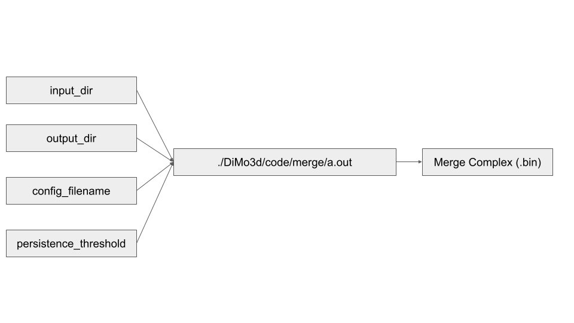

# 3D Discrete Morse Graph Reconstruction Python Package

* [Introduction](#introduction)
* [Installation Intructions](#installation-instructions)
  * [System Requirements](#system-requirements)
  * [Required Python Libraries](#required-python-libraries)
  * [Compiling Code](#compiling-code)
  * [MATLAB Scripts](#matlab-scripts)
* [DiMo3D Functions](#dimo3d-functions)
* [Separate Programs](#separate-programs)
* [MATLAB Scripts](#matlab-scripts)
* [Example Use of Pipeline](#example-use-of-pipeline)  

## Introduction

DiMo3d is a python package (with underlying matlab functions and c++ libraries) that can be used to compute DM graph reconstructions for 3D imaging data.  There are functions for dividing an image stack into subregions, computing persistence diagram for each subregion (required for computing DM graph reconstruction, but could also be of independent interest), computing DM graph reconstruction for each subregion, merging graphs of subregions into a single graph for the full image_stack, and writing graphs to .vtp format to be visualize by applications such as paraview (https://www.paraview.org/).

DM graph reconstruction is a methodology used to extract true underlying graph structure behind noisy input data.  The input for the algorithm is a density function defined on a triangulation, and the output graph is the mountain ridges of the input density function.  For mouse brain imaging data, the density function used is simply the voxel values. The mountain ridges of the density function do an excellent job of captures the neuronal branches in the image stack.  However, the persistence computation is a computational bottleneck, and cannot be performed on large datasets.  By dividing input images into overlapping subregions, the pipeline is able to efficiently extract accurate graphs for each subregion, and merge these graphs into a single reconstruction for the full domain.

This package was designed to be an intergral part of the pipeline to extract single neuron reconstructions from full mouse brain imaging data.  While the pipeline will output a graph capture all neuronal branches, further postprocess of the graph will be required to obtain individual neuron reconstructions.  The package, while designed with mouse imaging data specifically in mind, can be used on any 3D imaging dataset.  Optimal parameters will vary by dataset and intended use case of the graphs.

## Installation Instructions

Copy DiMo3d to your current working directory, then ensure all system requirements and python libraries are installed.  Then compile c++ programs that the library calls, and copy matlab functions to the current working directory.  See below for specific instructions.

### System Requirements
- Python 3.8.8 (or newer)
- g++ 9.4.0 (or newer)
- cmake 3.16.3 (or newer)

### Required Python Libraries

- cv2 (https://pypi.org/project/opencv-python/)

    >pip install opencv-python

- PIL (https://pypi.org/project/Pillow/)

    >pip install pillow

- vtk (https://pypi.org/project/vtk/)

    >pip install vtk

### Compiling Code

Dipha Persistence Module

    > cd ./DiMo3d/code/dipha-3d/
    > mkdir build
    > cd build
    > cmake ../
    > make

Discrete Morse Graph Reconstruction Module

    > cd ./DiMo3d/code/dipha-output/
    > g++ ComputeGraphReconstruction.cpp
    
Merge Complex Module
    
    > cd DiMo3d/code/merge/
    > g++ combine.cpp

Complex Persistence + Discrete Morse Graph Reconstruction Module
    
    > cd DiMo3d/code/spt_cpp/
    > g++ DiMoSC.cpp -I./phat/include -std=c++11 -o spt_cpp
    
### MATLAB Scripts

    > cp ./DiMo3d/code/matlab/* ./

## DiMo3d Functions

### DiMo3d.split_domain(input_dir, output_dir, x_len, y_len, z_len, overlap=5)

#### Description
Given an input image stack, divide the image stack into overlapping subregions.  The purpose of this is to have subregions of a size such that the DM graph reconstruction algorithm is efficient to run on each individual region.  It is recommended to take as large of subregions as possible such that the running time for DM graph reconstruction is still acceptable to the user.  Overlap of subregions allows for the merging of the graphs of subregions into a single graph for the full domain. It is recommended to take as small of an overlap as possible such that all individual neuron branches that cross subregions are correctly captured after merging graphs.

#### Input
- Input_dir - path to input image stack
- output_dir - path to dir containing results for each subregion
- x_len - x-axis length of each subregion
- y_len - y-axis length of each subregion
- z_len - z-axis length of each subregion
- overlap - pixel overlap for each axis between adjacent subregions

#### Output

Output dir is made containing subdirectories for each region.  Each region contains an image stack and its startings x,y,z coordinates
Returns nx, ny, nz, and overlap - the x/y/z dimensions of the image stack and the overlap for each axis

#### Example

    >import DiMo3d as dm

    >image_stack_dir = “data/image_stack/”
    >morse_dir = “results/image_stack_morse/”
    >dm.split_domain(image_stack_dir, morse_dir, 64, 64, 64, 5)

### DiMo3d.write_dipha_persistence_input(input_path)

#### Description
The first step of compute DM graph reconstruction to compute the persistence diagrams of each subregion.  This packages uses a modified version of the DIPHA software for this computation.  DIPHA takes specifically formatted input file - this function creates the required input file for each subregion in the domain.

#### Input
- input_path - input path to the directory containing subregions for which we will need to compute persistence on.  This argument should match output_dir of a previous DiMo3d.split_domain call.

#### Output

Input file for DIPHA program.  A file is written for each subregion.

#### Example

    >import DiMo3d as dm

    >image_stack_dir = “data/image_stack/”
    >morse_dir = “results/image_stack_morse/”
    >dm.split_domain(image_stack_dir, morse_dir, 64, 64, 64, 5)
    >dm.write_dipha_persistence_input(morse_dir)

### DiMo3d.compute_dipha_persistence(input_path, threads=1)

#### Description

The first step of compute DM graph reconstruction to compute the persistence diagrams of each subregion.  This packages uses a modified version of the DIPHA software for this computation.  DIPHA takes specifically formatted input file.  After generating the input files for the dipha program for each subregion (DiMo3d.write_dipha_persistence_input) this function will call the DIPHA program to compute the persistence diagram for each subregion.

#### Input
- input_path - input path to the directory containing subregions for which we will need to compute persistence on.  This argument should be the same as input_path of a previous DiMo3d.write_dipha_persistence_input call
- threads - number of threads used to run in parallel

#### Output

Persistence Diagram for each subregion.  A file is written for each subregion.

#### Example

    >import DiMo3d as dm

    >image_stack_dir = “data/image_stack/”
    >morse_dir = “results/image_stack_morse/”
    >dm.split_domain(image_stack_dir, morse_dir, 64, 64, 64, 5)
    >dm.write_dipha_persistence_input(morse_dir)
    >dm.compute_dipha_persistence(morse_dir)

### DiMo3d.convert_persistence_diagram(input_path, threads=1)

#### Description
The DM graph reconstruction program takes a specifically formatted file of persistence values of edges in domain as input.  The DIPHA program outputs this information but in an incompatiable format.  This function will convert the DIPHA output containing the persistence information needed to perform DM graph reconstruction for each subregion.

#### Input
- input_path - input path to the directory containing subregions for which we will need to compute persistence on.  This argument should be the same as input_path of a previous DiMo3d.compute_dipha_persistence call
- threads - number of threads used to run in parallel

#### Output

Persistence Diagram for each subregion in format meant for discrete Morse graph reconstruction program.  A file is written for each subregion.

#### Example

    >import DiMo3d as dm

    >image_stack_dir = “data/image_stack/”
    >morse_dir = “results/image_stack_morse/”
    >dm.split_domain(image_stack_dir, morse_dir, 64, 64, 64, 5)
    >dm.write_dipha_persistence_input(morse_dir)
    >dm.compute_dipha_persistence(morse_dir)
    >dm.convert_persistence_diagram(morse_dir)

### DiMo3d.write_vertex_file(input_path, threads=1)

#### Description
The DM graph reconstruction program takes a file as input that contains the coordinates and density (voxel) function values.  This function will convert the image stack of each subregion into the .txt format required by the DM graph reconstruction algorithm.

#### Input
- input_path - input path to the directory containing subregions for which we will need to compute persistence on.  This argument should be the same as input_path of a previous DiMo3d.convert_persistence_diagram call
- threads - number of threads used to run in parallel

#### Output

Text file containing vertex coordinates for each subregion in format meant for discrete Morse graph reconstruction program.  A file is written for each subregion.

#### Example

    >import DiMo3d as dm

    >image_stack_dir = “data/image_stack/”
    >morse_dir = “results/image_stack_morse/”
    >dm.split_domain(image_stack_dir, morse_dir, 64, 64, 64, 5)
    >dm.write_vertex_files(morse_dir)

### DiMo3d.graph_reconstruction(input_path, persistence_threshold, threads=1)

#### Description
Run discrete Morse graph reconstruction on each subregion within input_path directory.  The persistence threshold is the only parameter required - a higher threshold will results in a greater simplification of the output graph (fewer edges).  Outputs are stored in a folder named after the persistence threshold - so a user can see results at a specific threshold then rerun with an appropriately adjusted threshold.

#### Input
- input_path - input path to directory containing subregions for which we will need to compute persistence on.  This argument should be the same as input_path of a previous DiMo3d.convert_persistence_diagram call
- persistence_threshold - value of persistence threshold parameter used by discrete Morse graph reconstruction algorithm.
- threads - number of threads used to run in parallel

#### Output

Vertex and edge file representing the discrete Morse graph reconstruction output.  The graph files are stored in a directory for the persistence threshold for each threshold

#### Example

    >import DiMo3d as dm

    >image_stack_dir = “data/image_stack/”
    >morse_dir = “results/image_stack_morse/”
    >dm.split_domain(image_stack_dir, morse_dir, 64, 64, 64, 5)
    >dm.write_dipha_persistence_input(morse_dir)
    >dm.compute_dipha_persistence(morse_dir)
    >dm.convert_persistence_diagram(morse_dir)
    >dm.write_vertex_file(morse_dir)
    >dm.graph_reconstruction(morse_dir, 32)

### DiMo3d.merge(input_path, merge_dir, persistence_threshold, merge_threshold, nx, ny, nz, x_len, y_len, z_len, overlap, threads=1)

#### Description

Perform DM-based hierarchical merging of graphs of subregions. After getting graph reconstructions for each subregion, a user can merge the graphs together in order to obtain a single graph for the entire domain. Merging is required because branches that cut across different subregions might not already be connected by taking the union of the two graphs.  First a triangulation is built in the overlap regions, which connects branches meant to be merged. Density estimation is used assign density values to each vertex in the triangulation. Then DM graph reconstruction is performed to extract the true connection path between overlap regions.  These triangulations are significantly smaller than that of the full domain, making the merging significantly more efficient than running DM graph reconstruction on full domain.

#### Input
- input_path - input path to directory containing subregions for which we will need to compute persistence on.  This argument should be the same as input_path of a previous DiMo3d.convert_persistence_diagram call
- merge_dir - directory for merge results will be written to 
- persistence_threshold - value of persistence threshold parameter used by discrete Morse graph reconstruction algorithm.
- merge_threshold - persistence threshold used during DM computation for merges
- nx - size of x axis of original image stack
- ny - size of y axis of original image stack
- nz - size of z axis of original image stack
- x_len - base size of x axis for subregions
- y_len - base size of y axis for subregions
- z_len - base size of z axis for subregions
- overlap - size of overlap on axes between regions
- threads - number of threads used to run in parallel

#### Output

Vertex and edge files representing the discrete Morse graph reconstruction output.

#### Example

    >import DiMo3d as dm

    >image_stack_dir = “data/image_stack/”
    >morse_dir = “results/image_stack_morse/”
    >dm.split_domain(image_stack_dir, morse_dir, 64, 64, 64, 5)
    >dm.write_dipha_persistence_input(morse_dir)
    >dm.compute_dipha_persistence(morse_dir)
    >dm.convert_persistence_diagram(morse_dir)
    >dm.write_vertex_file(morse_dir)
    >dm.graph_reconstruction(morse_dir, 32)
    >dm.merge(morse_dir, merge_dir, 32, 32, 256, 256, 256, 64, 64, 64, 5, 1)

### DiMo3d.write_vtp_graph(vert_filename, edge_filename, output_filename)

#### Description
Convert .txt format graph (vert file and edge file) to .vtp format.  Through the package, DM graphs are outputted as two .txt files - a text file for vertices and a text file for edges.  Different formatting is required to visualize graphs in 3rd party software.  This function will output a .vtp file for the specified input graph.  .vtp can be viewed in softwares such as Paraview.

#### Input
- vert_filename - vertex coordinates of graph
- edge_filename - edges of graph
- output_filename - vtp formatted graph file

#### Output

A single file (output_filename) written in .vtp format containing the input graph

#### Example

    >import DiMo3d as dm

    >vert_filename = “/path/to/dimo_vert.txt”
    >edge_filename = “/path/to/dimo_edge.txt”
    >output_filename = "/path/to/graph.vtp"
    >dm.write_vtp_graph(vert_filename, edge_filename, output_filename)

### DiMo3c.extract_subregion(input_dir, output_dir, x_center, y_center, z_center, x_len, y_len, z_len, threads=1):

#### Description
Extract a subregion from full brain fMOST image stack.  This function is meant for extracting a subregion off of an fMOST image stack. fMOST brain imaging data is huge and can take a very long time to process.  Taking a smaller - but still sizable subregion is a great way to see DM graphs for meaningful portions of the brain.

#### Input
- input_dir - input image stack of large (presumably full) domain
- output_dir - directory subregion image stack will be stored
- x_center - subregion center's x coordinate (in microns! - take from ground truth .swc file)
- y_center - subregion center's y coordinate (in microns! - take from ground truth .swc file)
- z_center - subregion center's z coordinate (in microns! - take from ground truth .swc file)
- x_len - length of x-axis of subregion (in pixels!)
- y_len - length of y-axis of subregion (in pixels!)
- z_len - length of z-axis of subregion (in pixels!)
- threads - images handled at a time

#### Output

Image stack of a subregion of an fMOST brain

#### Example

    >import DiMo3d as dm

    >dm.extract_subregion("data/image_stack/", "results/smaller_image_stack/", 128, 128, 128, 64, 64, 64)

## Separate Programs

### Dipha Persistence Program (code/dipha-3d/build/dipha)

#### Description

Compute persistence diagram of 3D image stack.  The program is a modified version of the code found at (https://github.com/DIPHA/dipha).

#### Python Function

DiMo3d.compute_dipha_persistence

#### Input
- input_filename - path to DIPHA input file
- output_filename - filename for traditional DIPHA program persistence diagram
- edge_filename - filename for edge information - vertices, edge type (negative or positive), and persistence value

#### Output:

Binary file (edge_filename) containing persistence information for all edges

### Discrete Morse Graph Reconstruction Program (./DiMo3d/code/dipha-output/a.out)

#### Description

Executes discrete Morse graph reconstruction algorithm

#### Python Function

DiMo3d.graph_reconstruction

#### Input

- vert_filename - file contain verts in domain
- dipha_edge_filename - .txt format of edge persistence information
- persistence threshold - persistence threshold for graph reconstruction algorithm
- output_dir - directory where output graph will be written

#### Output

Graph (dimo_vert.txt and dimo_edge.txt) written to output_dir

### Build Merge Complex (./DiMo3d/code/merge/a.out)

#### Description

Builds a single complex out of multiple subregion's graphs to output that will be simplified with the DM graph reconstruction algorithm

#### Python Function

DiMo3d.merge

#### Input

- input_dir - directory with results we will need to merge
- output_dir - directory where merge results will be saved
- config_filename - file containing information of regions we will merge
- persistence_threshold - threshold of graphs we wish to merge - this is NOT the persistence threshold used for simplifying DM graph of the output complex

#### Output

A single complex built from up to 8 individual subregions DM graph reconstructions.  Will perform another round of DM on this output to get a single graph reconstruction for all subregions

### Simplicial Complex Morse Program (./DiMo3d/code/spt_cpp/spt_cpp)

#### Description

Run DM Graph reconstruction on a simplicial complex with density function defined on its vertices.  The program is a modified version of the code found at (https://github.com/wangjiayuan007/graph_recon_DM).

#### Python Function

DiMo3d.merge

#### Input

- input_filename - simplicial complex file (.bin) 
- output_dir - directory where morse graph will be written
- persistence_threshold - threshold used by DM graph reconstruction algorithm
- dimension - dimension simplicial complex lies within (this should always be 3 for the sake of this pipeline)

#### Output

Graph in .txt format (overlap_dimo_vert.txt and overlap_dimo_edge.txt)

## MATLAB Scripts

### parallel_dipha_input.m

#### Description

Creates DIPHA input file for all subregions

#### Python Function
		
DiMo3d.write_dipha_persistence_input

#### Input
input_path - input path to directory containing subregions for which we will need to compute persistence on.
valid_filename - filename containing list of valid subregions.  This is generated within the python pipeline

#### Output

DIPHA input file for each subregion.  A subregion’s file is written to its results directory

### load_persistence_diagram.m

#### Description

Converts DIPHA persistence diagram to .txt format for use by Discrete Morse Graph Reconstruction program

#### Python Function
		
DiMo3d.convert_persistence_diagram

#### Input
- input_filename - Persistence diagram output directly from DIPHA program (.bin format)
- output_filename - filename for .txt format of persistence diagram

#### Output

Persistence Diagram in .txt format for each subregion

## Example Use of Pipeline

    >import DiMo3d as dm

    >persistence_threshold = 256
    >merge_persistence_threshold = 256
    >image_stack_dir = “data/image_stack/”
    >morse_dir = “results/image_stack_morse/”
    >merge_dir = “results/image_stack_merge/”
    >nx, ny, nz, overlap = dm.split_domain(image_stack_dir, morse_dir, 128, 128, 128, 16)
    >dm.write_dipha_persistence_input(morse_dir)
    >dm.compute_dipha_persistence(morse_dir)
    >dm.convert_persistence_diagram(morse_dir)
    >dm.write_vertex_file(morse_dir)
    >dm.graph_reconstruction(morse_dir, persistence_threshold)
    >dm.merge(morse_dir, merge_dir, persistence_threshold, merge_persistence_threshold, nx, ny, nz, 128, 128, 128, overlap, 1)

